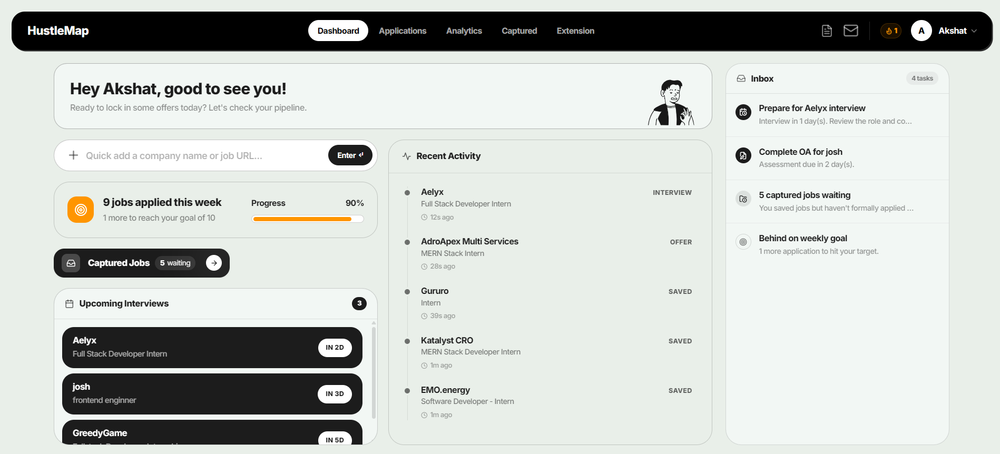
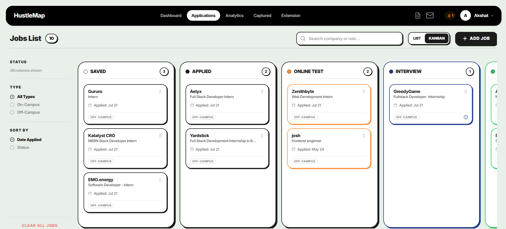
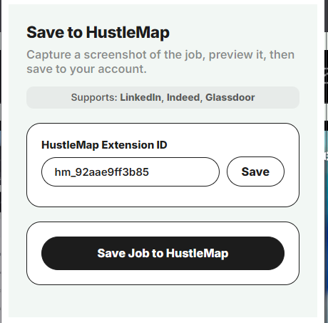
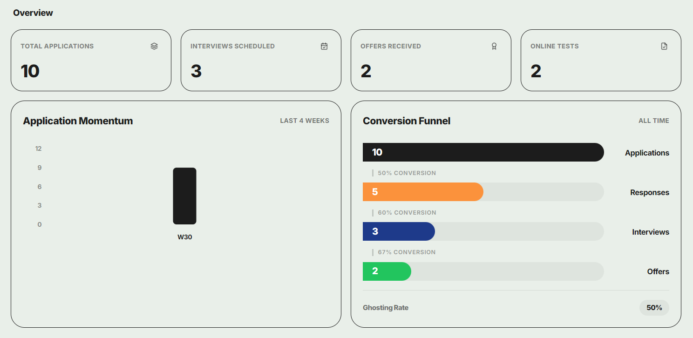
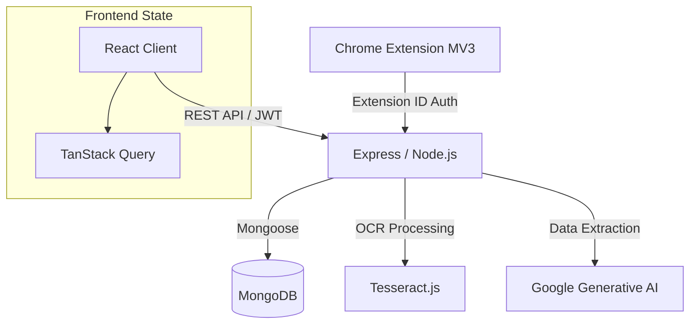

<div align="center">
  
  <h1>HustleMap</h1>
  <p><strong>A full-stack, analytics-driven job application tracking platform with a custom Chrome Extension for frictionless data capture.</strong></p>

  <a href="#architecture">Architecture</a> •
  <a href="#features">Features</a> •
  <a href="#engineering-highlights">Engineering</a> •
  <a href="#chrome-extension">Extension</a>
</div>

---

## Problem Statement

The modern job hunt is fragmented. Engineers manage applications across LinkedIn, Indeed, Glassdoor, and company portals, often resulting in messy spreadsheets, missed follow-ups, and lost interview context. **HustleMap** centralizes the job search pipeline by combining a robust React/Node.js dashboard with a purpose-built Chrome Extension. Instead of manual data entry, users draw a bounding box over a job posting, and the extension instantly captures and syncs the data to the backend via an OCR/AI pipeline.

## Features

| Feature | Description |
|---------|-------------|
| **Frictionless Capture** | Custom MV3 Chrome Extension allowing users to draw and capture job descriptions directly from supported boards. |
| **Intelligent Parsing** | Backend pipeline utilizing `tesseract.js` (OCR) and `@google/generative-ai` to extract structured data from screenshots. |
| **Pipeline Management** | Interactive Kanban board and list views to track applications from *Applied* to *Offer*. |
| **Interview Prep Hub** | Dedicated modules to log technical questions, track rounds, rate difficulty, and store preparation notes. |
| **Actionable Analytics** | Real-time dashboards built with `Recharts` displaying conversion funnels, weekly trends, and actionable prioritized tasks. |
| **Real-time Sync** | Cross-tab synchronization using local storage events and TanStack Query invalidation. |

## Product Tour

> **Note:** The screenshots below demonstrate the core features of HustleMap in action.

| Dashboard | Job Pipeline |
| :---: | :---: |
|  |  |
| *High-signal metrics and weekly progress tracking.* | *Drag-and-drop pipeline management.* |

| Extension Capture | Detailed Analytics |
| :---: | :---: |
|  |  |
| *On-page bounding box capture on LinkedIn/Indeed.* | *In-depth metrics, conversion funnels, and activity trends.* |

## Architecture



## Technology Stack

| Layer | Technologies | Responsibility |
|-------|--------------|----------------|
| **Frontend** | React 18, Vite, Tailwind CSS, Radix UI | Component-driven UI, responsive design, accessible primitives. |
| **State** | TanStack Query, React Router | Server state caching, optimistic updates, client-side routing. |
| **Backend** | Node.js, Express | RESTful API orchestration, CORS management, request validation. |
| **Database** | MongoDB, Mongoose | Schema validation, relational mapping (Users ↔ Jobs), aggregations. |
| **AI / OCR** | Tesseract.js, `@google/generative-ai` | Fallback text extraction and AI-driven structured data parsing. |
| **Extension** | Manifest V3, Vanilla JS | Content script injection, activeTab screenshotting, seamless POSTing. |

## Engineering Highlights

### 1. Frictionless Extension Communication
The Chrome Extension bypasses traditional JWT friction. Instead of requiring users to log in within the extension popup, the web app generates a unique **Extension ID**. The extension securely POSTs base64 screenshot payloads directly to the backend using this ID. 

### 2. Intelligent Data Extraction Pipeline
Capturing a screenshot is only half the problem. The backend (`/api/jobs/screenshot`) utilizes `multer` for multipart payload handling, falls back to `tesseract.js` for OCR text extraction, and leverages `@google/generative-ai` to convert raw image data/text into structured JSON (Company, Role, Requirements).

### 3. Cross-Tab State Synchronization
To ensure the dashboard instantly reflects jobs saved via the extension, the frontend utilizes a custom `AutoSyncQueries` wrapper. It listens to `storage` events (`hustlemap_last_job_saved`) and `window.postMessage`, automatically invalidating TanStack Query caches to re-fetch data in real-time without manual page reloads.

### 4. Robust CORS Strategy
The Express server implements a dynamic CORS configuration, distinguishing between standard web traffic (verifying against a `CLIENT_URL` whitelist), server-to-server traffic, and `chrome-extension://` origins to ensure maximum security without blocking the MV3 extension.

## API Documentation

*A full breakdown is available in `docs/API.md`.*

| Method | Endpoint | Purpose | Auth Required |
|--------|----------|---------|---------------|
| `POST` | `/api/jobs/save-from-extension` | Save parsed job from extension. | Extension ID |
| `POST` | `/api/jobs/screenshot` | Process raw screenshot payload via OCR/AI. | Extension ID |
| `GET`  | `/api/jobs/dashboard-feed` | Aggregate priority tasks and upcoming interviews. | JWT |
| `GET`  | `/api/jobs/stats` | Fetch conversion metrics and pipeline counts. | JWT |

## Installation & Setup

### Prerequisites
- Node.js 18+
- MongoDB instance (local or Atlas)

### 1. Clone & Install
```bash
git clone <repository-url>
cd HustleMap

# Install Backend
cd server && npm install

# Install Frontend
cd ../client && npm install
```

### 2. Environment Variables
Create `.env` files based on the `.env.example` templates.

**`server/.env`**
```env
PORT=5000
NODE_ENV=development
MONGO_URI=mongodb://localhost:27017/hustlemap
JWT_SECRET=your_secure_jwt_secret
# Required if using AI extraction features
GEMINI_API_KEY=your_gemini_api_key
```

**`client/.env`**
```env
VITE_API_URL=http://localhost:5000/api
```

### 3. Run Development Servers
```bash
# Terminal 1 (Backend)
cd server && npm run dev

# Terminal 2 (Frontend)
cd client && npm run dev
```

## Chrome Extension Setup

1. Open `chrome://extensions` in Google Chrome.
2. Enable **Developer mode** in the top right.
3. Click **Load unpacked** and select the `hustlemap-extension` directory.
4. In the HustleMap web dashboard, navigate to the `/extension` page to generate your **Extension ID**.
5. Click the extension icon in Chrome, open settings, and paste your ID.

## Contributing
Contributions are welcome. Please ensure that PRs are focused, and that local endpoints (especially the screenshot parsing pipeline) have been verified before submitting.

## License
MIT License (Pending addition to repository)
